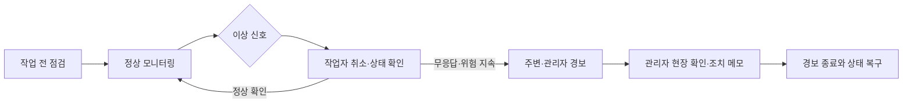

# Smart Safety Helmet — 관제 흐름 시뮬레이터

**센서 기능을 나열하는 대신, 이상 신호가 실제 대응과 책임 인계로 이어지는 흐름을 검증한 제품 프로토타입입니다.**

[Live demo](https://nu-mocha-93.vercel.app) · `React 19` · `TypeScript` · `State Flow` · `Human Handoff`

| Product question | Prototype decision | What can be reviewed | Boundary |
| --- | --- | --- | --- |
| 경보 뒤 누가 무엇을 확인하고 조치하는가 | 작업자 취소·무응답 확인·주변 전파·관리자 조치를 하나의 상태 흐름으로 연결 | 작업자/관리자 양쪽 화면, 경보 우선순위, 조치 메모 | 실제 센서·AI·신고 연동과 현장 안전성은 검증 전 |

> **제가 맡은 연결부** — 팀의 센서·안전 아이디어를 사고 전·중·후 사용자 여정과 공통 TypeScript 상태 모델로 통합했습니다.

스마트 안전모 아이디어를 센서 목록에서 시작하면 기능은 많아지지만, 사고가 발생했을 때 **누가 어떤 신호를 보고 무엇을 해야 하는지**는 여전히 불명확할 수 있습니다.

이 프로젝트는 센서 하드웨어를 구현하기보다 작업 전 점검, 이상 신호 감지, 작업자 상태 확인, 주변 전파와 관리자 조치까지 이어지는 운영 흐름을 먼저 검증하기 위해 만들었습니다. 작업자 화면과 관리자 관제 화면을 한 프로토타입에서 오가며, 경보가 실제 대응으로 연결되기 위해 필요한 정보와 인터랙션을 탐색합니다.

> 이 저장소는 센서·AI·신고 연동의 콘셉트 시뮬레이터입니다. 화면의 생체·환경 데이터는 mock이며 의료기기, 안전장비 또는 실제 긴급 신고 시스템이 아닙니다.

## 문제 정의

산업 안전 시스템에서 경보를 만드는 것만으로는 충분하지 않다고 보았습니다.

| 사고 대응의 단절 | 프로토타입에서 확인하는 흐름 |
| --- | --- |
| 작업 시작 전 장비 상태를 확인하지 않음 | 블루투스·센서·착용·환경 점검 온보딩 |
| 이상 신호가 오경보인지 즉시 구분하기 어려움 | 작업자 취소 시간과 음성 상태 확인 시뮬레이션 |
| 관리자가 숫자만 보고 현장 맥락을 알기 어려움 | 작업 위치·업무·생체·환경 신호를 한 화면에서 결합 |
| 작업자가 직접 신고 버튼을 누르지 못할 수 있음 | 무응답 상태와 인접 작업자·관리자 전파 흐름 |
| 경보 해제 뒤 조치 근거가 남지 않음 | 관리자 조치 메모와 알림 상태 기록 |

핵심 가설은 “센서 정확도”만 높이는 것보다 **오경보를 취소할 기회, 무응답을 확인하는 단계, 주변 작업자와 관리자에게 전달할 맥락**을 함께 설계해야 대응 시간을 줄일 수 있다는 것입니다.

## 시뮬레이션 범위

### 작업자 화면

- 작업 전 센서 연결·착용·환경 점검
- 심박, 산소, 가스, 충격과 안전모 착용 상태 표현
- 낙상·가스·위험 구조물 경보 시나리오
- 오경보 취소와 음성 상태 확인 인터랙션
- 위험 요소 수동 공유와 주변 경보 화면

### 관리자 화면

- 작업자 상태와 경보 우선순위 통합 조회
- 선택 작업자의 위치·업무·센서 맥락 확인
- 주의·위험 조건에 따른 조치 제안
- 음성·진동 등 알림 수단 선택
- 관리자 조치 메모와 경보 종료 흐름

### 현재 구현하지 않은 것

- 실제 안전모 센서와 Bluetooth·LoRa·5G 통신
- 의료적 상태 판정 또는 검증된 AI 추론
- 실제 GPS·실내측위와 119 자동 신고
- 운영 환경의 인증·권한·감사 로그
- 산업안전 규정과 현장 사용성 검증

## 상태 흐름



## 기술 스택

| 영역 | 기술 | 역할 |
| --- | --- | --- |
| Application | React 19, TypeScript | 작업자·관리자 상태와 상호작용 구현 |
| Build | Vite | 빠른 프로토타입 개발과 정적 배포 |
| UI | Tailwind CSS 4, Radix UI, shadcn | 관제 화면 컴포넌트와 상태별 표현 |
| Motion | Motion | 경보·상태 전환의 시각적 피드백 |
| Browser API | Speech Synthesis | 음성 경보와 확인 흐름 시뮬레이션 |
| Data | TypeScript mock data | 센서와 작업자 상태의 반복 가능한 데모 |
| Deployment | Vercel | 설치 없이 역할별 흐름 검토 |

현재 상태 판단은 실제 모델 추론이 아니라 명시적인 프론트엔드 규칙과 mock 데이터로 동작합니다. 초기 프로토타입에 포함됐던 미사용 AI·서버 의존성과 브라우저 번들 환경변수 주입은 제거했습니다.

## 실행

Node.js 20 이상을 권장합니다.

```bash
npm install
npm run dev
```

```bash
npm run lint
npm run build
```

데모 계정은 실제 인증 시스템이 아니라 역할별 화면을 확인하기 위한 고정 입력입니다. 운영 단계에서는 서버 인증과 역할 기반 권한을 별도로 구현해야 합니다.

## 담당 범위와 협업 관점

- 팀의 센서·안전 기능 아이디어를 사고 전·중·후 사용자 흐름으로 정리
- 작업자 화면과 관리자 관제 화면 사이의 정보 전달 기준 정의
- 센서 상태, 경보 단계와 조치 기록을 공통 TypeScript 타입으로 구조화
- 디자인·기획 의견을 클릭 가능한 React 프로토타입으로 통합
- 구현된 시뮬레이션과 실제 하드웨어·AI 검증 범위를 명확히 분리

협업에서 중요하게 본 것은 기능의 개수가 아니라, 서로 다른 아이디어가 같은 사고 대응 흐름 안에서 충돌 없이 연결되는지였습니다. 화면을 통해 팀이 경보 발생 시점, 작업자의 취소 기회와 관리자의 개입 시점을 함께 검토할 수 있도록 했습니다.

## 다음 검증

1. 현장 작업자와 안전관리자 인터뷰로 오경보 취소·무응답 확인 흐름 검증
2. 실제 센서의 지연·누락·노이즈를 반영한 상태 머신 설계
3. 위험도별 알림 강도와 관리자 우선순위 사용성 테스트
4. 실내 위치, 작업 지시 정보와 센서 신호의 결합 가능성 검토
5. 산업안전·개인정보·생체정보 관련 법적·운영 요구사항 확인
