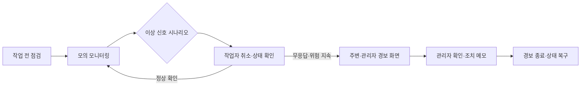

# Smart Safety Helmet

**경보가 작업자의 확인과 관리자의 조치로 이어지는 흐름**을 살펴보는 React 프로토타입입니다. 센서를 늘리기 전에, 오경보를 취소할 기회와 작업자가 응답하지 않을 때의 전달 순서를 화면으로 정리했습니다.

[데모 열기](https://nu-mocha-93.vercel.app) · `React 19` · `TypeScript` · `Vite` · `Tailwind CSS 4`

화면의 생체·환경·위치 데이터는 **mock**입니다. 실제 안전모 센서, 검증된 AI 추론, 의료적 상태 판정이나 긴급 신고 시스템을 연동한 제품은 아닙니다.

## 현재 구현

| 역할 | 확인할 수 있는 흐름 |
| --- | --- |
| 작업자 | 작업 전 연결·착용·환경 점검, 심박·산소·가스·충격 상태 표시 |
| 작업자 | 낙상·가스·구조물 경보 시나리오, 오경보 취소와 음성 상태 확인 |
| 작업자 | 위험 요소 수동 공유와 주변 경보 표시 |
| 관리자 | 작업자·위치·업무·센서 맥락, 경보 우선순위 통합 조회 |
| 관리자 | 조치 제안, 음성·진동 알림 선택, 조치 메모와 경보 종료 |



현재 상태 판단은 프론트엔드 규칙과 TypeScript mock 데이터로 동작합니다. 브라우저의 Speech Synthesis는 음성 경보를 시연하는 데 사용합니다. 화면에 나타나는 연결·측위·알림 상태를 실제 장비의 동작으로 해석하지 않습니다.

## 구현 과정에서 맡은 일

팀의 센서·안전 아이디어를 사고 전·중·후의 사용자 흐름으로 묶고, 작업자 화면과 관리자 화면의 정보 전달 기준을 정리했습니다. 센서 상태·경보 단계·조치 기록을 공통 TypeScript 타입으로 구성하고, 기획·디자인 의견을 클릭 가능한 React 화면으로 연결했습니다.

초기 프로토타입의 미사용 AI·서버 의존성과 브라우저 번들 환경변수 주입은 제거했습니다. 당시의 아이디어와 현재 실행되는 시뮬레이션 범위를 구분해 기록했습니다.

## 빠른 실행

저장소 루트에서 실행합니다. Node.js 20 이상을 권장합니다.

```bash
npm install
npm run dev
```

```bash
npm run lint
npm run build
```

데모 계정 입력은 역할별 화면을 확인하기 위한 고정 입력입니다. 실제 서버 인증이나 운영 권한 검증을 제공하지 않습니다.

## 기술과 범위

| 구성 | 사용 기술 |
| --- | --- |
| 화면·상태 | React 19, TypeScript |
| UI·전환 | Tailwind CSS 4, Radix UI, shadcn, Motion |
| 모의 데이터·음성 | TypeScript mock data, Speech Synthesis |
| 빌드·공유 | Vite, Vercel |

다음 항목은 현재 구현하거나 검증하지 않았습니다.

- 실제 안전모 센서, Bluetooth·LoRa·5G 통신과 GPS·실내측위
- 의료적 상태 판정, 검증된 AI 추론과 119 자동 신고
- 운영 인증·권한·감사 로그
- 현장 사용성, 대응 시간 감소와 산업안전 규정 충족

## 다음 검증과 문서 안내

다음 단계는 작업자·안전관리자 인터뷰로 취소와 무응답 확인 흐름을 검토하고, 센서의 지연·누락·노이즈를 반영하는 것입니다. 위험도별 알림 강도와 관리자 우선순위는 사용성 평가가 필요합니다. 위치·작업 지시·센서 정보의 결합 가능성과 개인정보·생체정보 관련 운영 요구도 도입 전에 확인해야 합니다.

현재 저장소의 설명은 이 README에서 확인할 수 있습니다. 실제 대응 성과나 센서 정확도를 평가한 보고서는 아직 없습니다.
